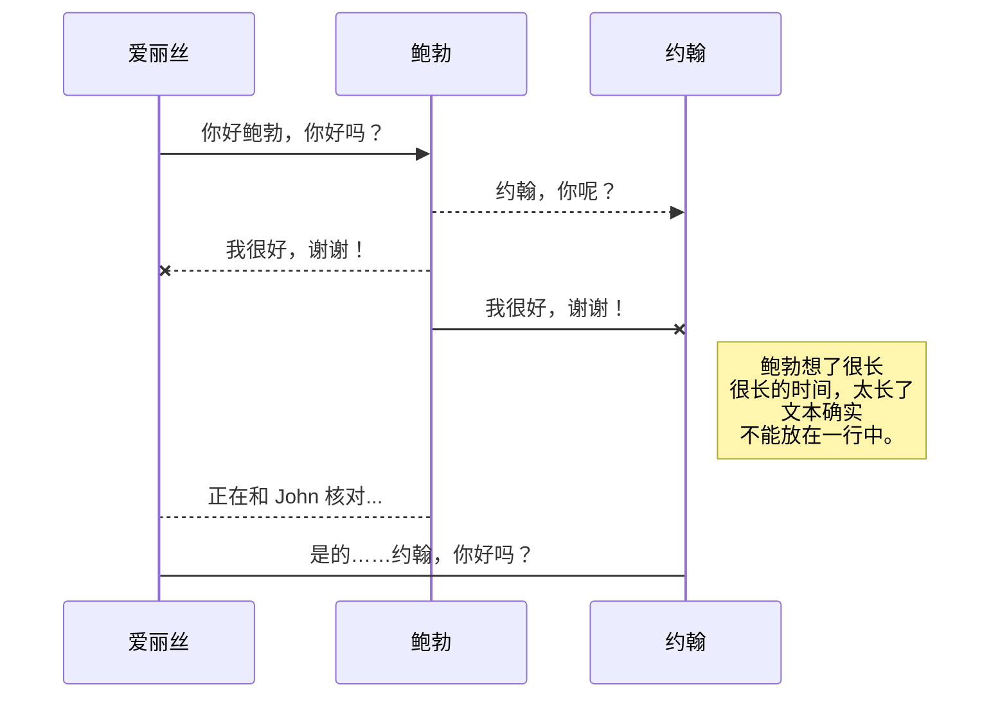
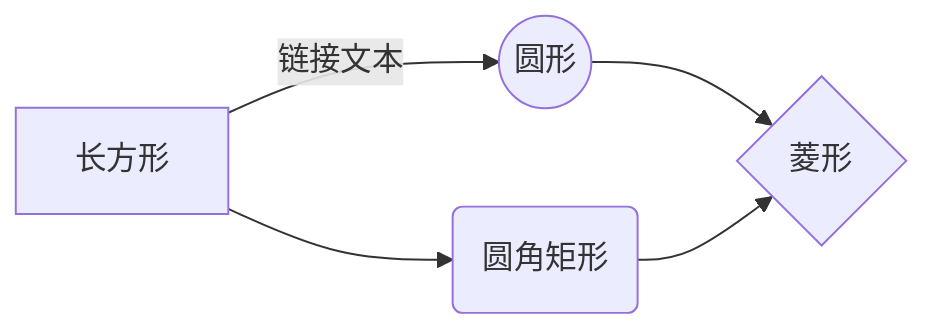

## UML 图

您可以使用 [Mermaid](https://mermaidjs.github.io/) 渲染 UML 图。例如，这将产生一个序列图：

```mermaid
sequenceDiagram
爱丽丝 ->> 鲍勃: 你好鲍勃，你好吗？
鲍勃-->>约翰: 约翰，你呢？
鲍勃--x 爱丽丝: 我很好，谢谢！
鲍勃-x 约翰: 我很好，谢谢！
Note right of 约翰: 鲍勃想了很长<br/>很长的时间，太长了<br/>文本确实<br/>不能放在一行中。

鲍勃-->爱丽丝: 正在和 John 核对...
爱丽丝->约翰: 是的……约翰，你好吗？
```

这将产生一个流程图：

```mermaid
graph LR
A[长方形] -- 链接文本 --> B((圆形))
A --> C(圆角矩形)
B --> D{菱形}
C --> D
```
<!--stackedit_data:
eyJoaXN0b3J5IjpbLTgwNjk2MjEyXX0=
-->